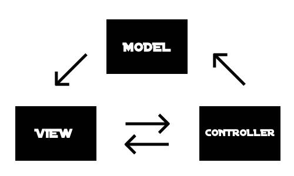

# Streamlit MVC



Este projeto foi desenvolvido para facilitar a transição de uma equipe especializada em PHP/Laravel — acostumada com a arquitetura MVC — para um novo ambiente em Python utilizando Streamlit.

A proposta é manter uma organização familiar, onde as requisições iniciam nas rotas (routes), seguem para os controladores (controllers) e, no caso das rotas web, são então direcionadas para as views (views), promovendo assim uma separação clara entre responsabilidades.

## 📁 Estrutura do Projeto
```
app/
│── main.py                         # Main entry point
│
│── routes/
│   ├── web.py                      # Web routes (streamlit)
│   ├── api.py                      # API routes (fastAPI)
│
│── controllers/                    # Handles app logic
│   ├── OportunidadeController.py
│   ├── VisaoGeralController.py
│
│── views/
│   ├── home.py                     # UI for the home page
│   ├── dashboard.py                # UI for the dashboard
│
│── models/
│   ├── data_loader.py              # Handles data fetching & processing
│   ├── database.py                 # Manages database operations
│
│── utils/
│   ├── helpers.py                  # Utility functions
│
│── assets/
│   ├── styles.css                  # Custom styling (if needed)
│   ├── images/                     # Store images
```

## 🚀 Como Executar o Projeto

### 1. Execução local (com Python)

Certifique-se de ter o Python instalado e execute o comando abaixo no terminal, a partir da raiz do projeto:

```bash
watchmedo auto-restart --debug-force-polling --pattern="*" --recursive -- python app/main.py
```

### 2. Execução com Docker Compose

Se preferir utilizar contêineres, basta executar:

```bash
docker compose up
```

Certifique-se de que o Docker e o Docker Compose estejam instalados e configurados corretamente.